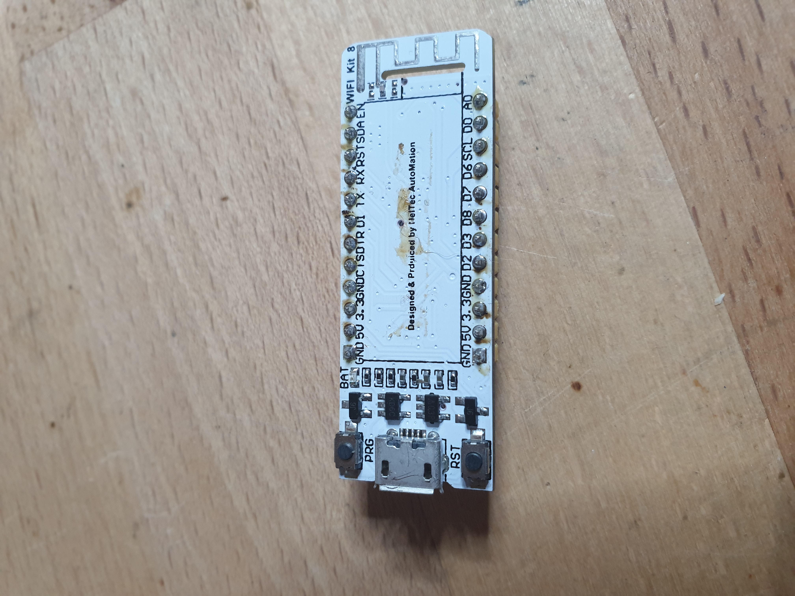
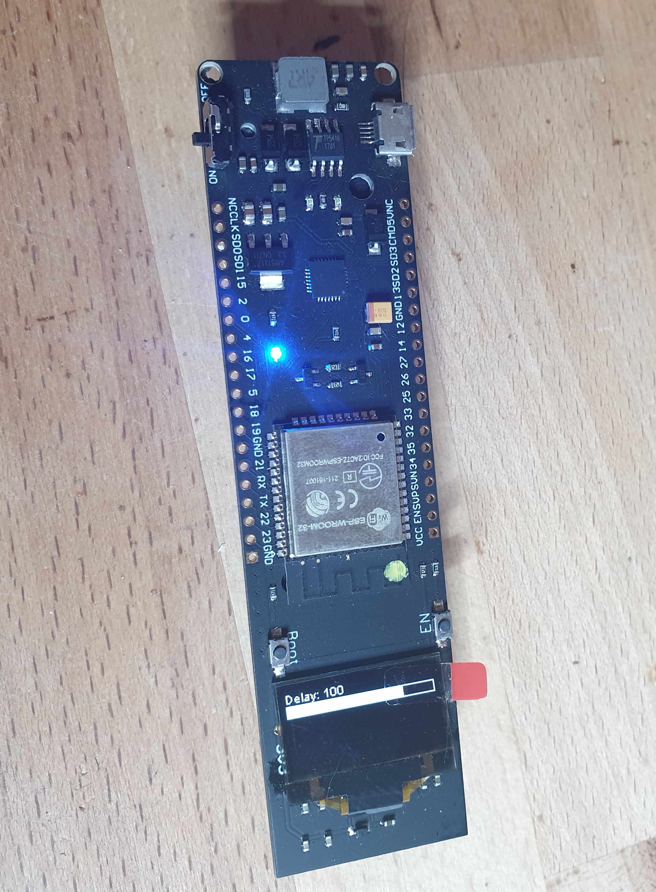
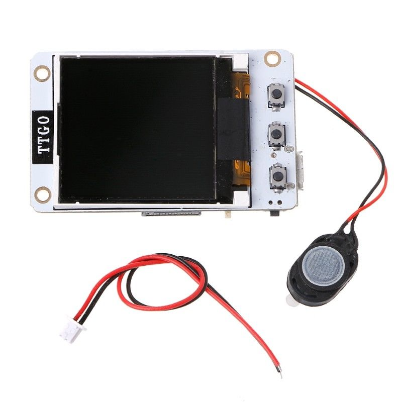
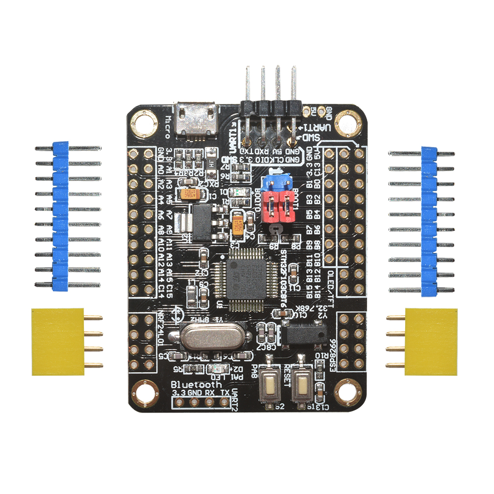
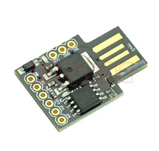

# HardwareModules
List of all my arduinos, ESPs, STM32s modules

# Displays
* 1,7 SPI 128x160 OLED ST7735  

* 4 Bits TM1637 Digital Tube LED Clock Display Module For Arduino Due UNO 2560 R3

* UTFT for arduino mege (Paltformio)
{width=40px height=40px}
{width=40px height=40px}

# ESP
* Heltec WiFi Kit 8  
* ESP32TTGO-OLED-18650  

* TS V1.0 Esp32 1.44 TFT Display MicroSD Card Slot Speakers WIFI Bluetooth Module 

* Wemos with Display [.jpg)](/Wemos-32-With-OLED)

# STM32
* BluePill  

* [STM32F103C8T6 ARM Minisystem Development Board STM32 Development Core Board 
](/STM32/STM32F103C8T6_ARM_Development_Board)

# Arduino

* Digistump ATTINY85  

# Shields (arduino)
* Multi function Shield  
* SIM808 GPS GSM GPRS Bluetooth Module W/2.4G Antenna Replace SIM908 For Arduino

# Battery Charger
* 3.7V 3.8V 7.4V 11.1V 12V 14.8V 18.5V Lithium li-on Lipo 18650 Battery Charger  

# Modules
* CP2102 Micro USB to UART TTL Module 6Pin Serial Converter STC Replace FT232
